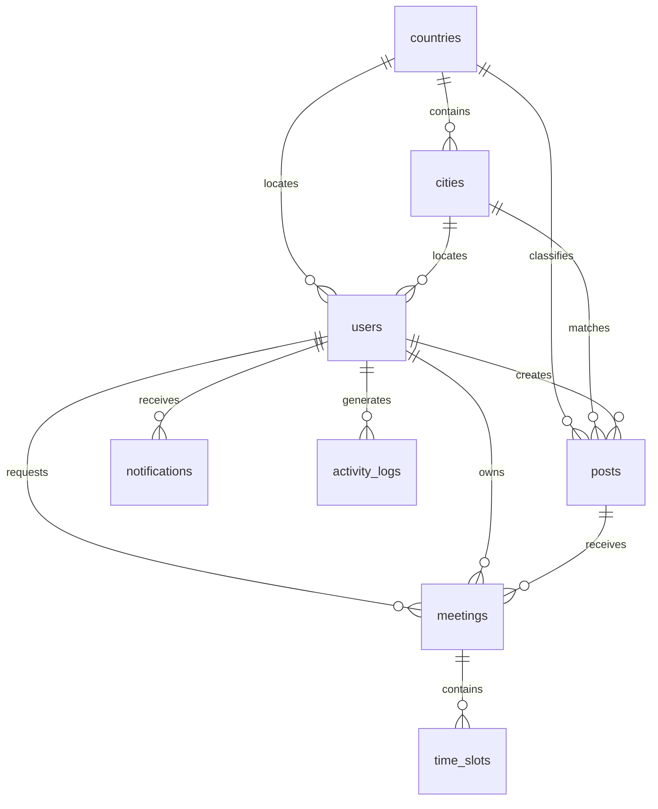

# ClinBridge Database Relationships

## Tables

- users
- countries
- cities
- posts
- meetings
- time_slots
- notifications
- activity_logs

## Foreign Keys

- cities.countryId -> countries.id
- users.countryId -> countries.id
- users.cityId -> cities.id
- posts.countryId -> countries.id
- posts.cityId -> cities.id
- posts.userId -> users.id
- meetings.postId -> posts.id
- meetings.requesterId -> users.id
- meetings.ownerId -> users.id
- time_slots.meetingId -> meetings.id
- notifications.userId -> users.id
- activity_logs.userId -> users.id

## ER Diagram

